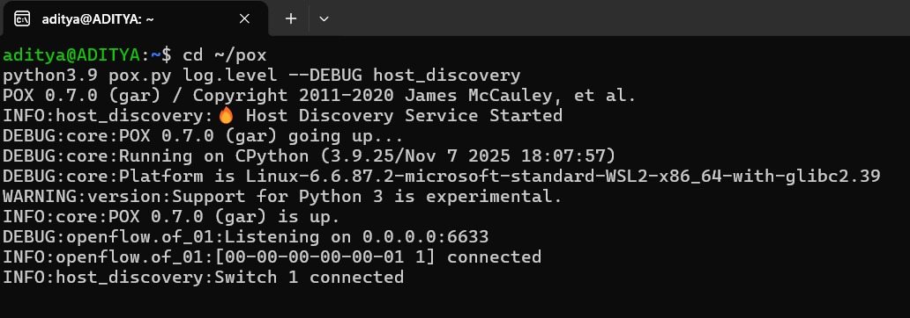
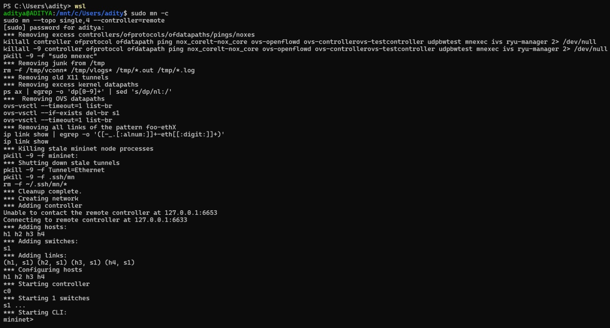
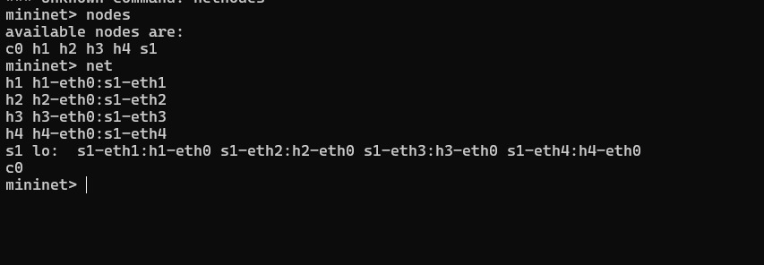
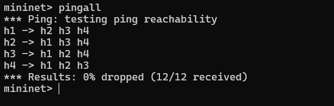
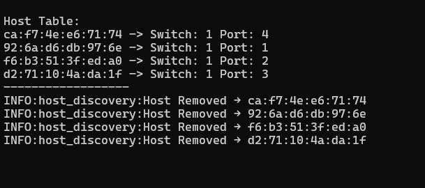
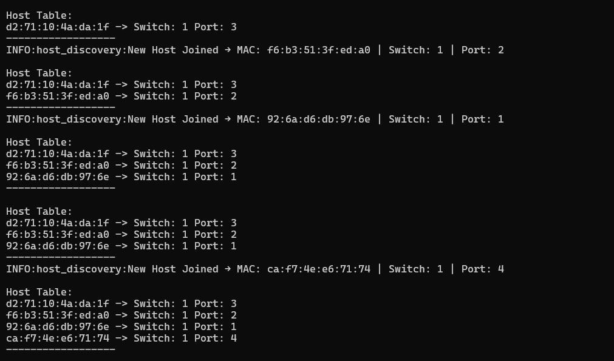

# Host Discovery Service using POX + Mininet

### NAME :

Your Name

### SRN :

Your SRN

### SECTION :

Your Section

---

## Problem Statement

Implement a Host Discovery Service in an SDN environment using Mininet and POX controller.

---

## Required Objectives

* Detect hosts dynamically in the network
* Maintain host database (MAC, switch, port)
* Update host information automatically
* Install flow rules for communication
* Demonstrate controller-switch interaction

---

## Technologies Used

* Ubuntu (WSL / Linux)
* Mininet
* Open vSwitch
* POX Controller
* OpenFlow 1.0

---

## Project Objective

The objective of this project is to implement a dynamic Host Discovery Service using Software Defined Networking (SDN).

Whenever a host sends a packet, the switch forwards it to the controller using a PacketIn event.
The controller extracts the host information such as MAC address, switch ID (DPID), and port number.

This information is stored in a host table and updated dynamically whenever changes occur.

Flow rules are installed to ensure efficient communication between hosts.

---

## Controller Logic

### File Name

`host_discovery.py`

### Controller Used

POX Controller

### Logic Implemented

* PacketIn handling
* MAC learning
* Host detection
* Dynamic host table update
* Flow rule installation

---

## Project Folder Structure

```text
~/pox/
 ├── pox.py
 ├── pox/
      ├── host_discovery.py
```

---

## How to Run the Project

### Step 1: Start POX Controller

```bash
cd ~/pox
python3.9 pox.py log.level --DEBUG host_discovery
```

---

### Step 2: Clean Previous Mininet Configuration

```bash
sudo mn -c
```

---

### Step 3: Start Mininet Topology

```bash
sudo mn --controller=remote --topo single,4
```

This creates:

* 1 switch
* 4 hosts

---

### Step 4: Verify Topology

```bash
nodes
net
```

---

### Step 5: Test Connectivity

```bash
pingall
```

Expected Output:

```text
0% packet loss
```

---

## Working Explanation

1. Host sends packet
2. Switch does not have rule
3. PacketIn sent to controller
4. Controller detects host
5. Host table updated
6. Flow rule installed
7. Communication becomes efficient

---

## Host Table Example

```text
MAC Address → Switch → Port
00:00:00:00:00:01 → s1 → 1
00:00:00:00:00:02 → s1 → 2
```

---

## Performance Observation

### Latency

Measured using:

```bash
pingall
```

Observation:

* First packet delayed due to PacketIn
* Subsequent packets faster due to flow rules

---

### Flow Behavior

* Unknown packets → Flooded
* Known packets → Direct forwarding

---

## Proof of Execution (Screenshots)

### Screenshot 1


POX Controller Running

### Screenshot 2


Mininet Topology

### Screenshot 3


Pingall Result (0% loss)

### Screenshot 4


Host Detection Logs

### Screenshot 5



Host Table Output

---

## Conclusion

This project successfully demonstrates dynamic host discovery in an SDN environment.

The controller detects hosts using PacketIn events, maintains a host table, updates changes dynamically, and installs flow rules for efficient communication.

---

## References

1. Mininet Official Documentation
   https://mininet.org/

2. POX Controller GitHub
   https://github.com/noxrepo/pox

3. OpenFlow Specification

4. Course Guidelines Provided by Faculty
